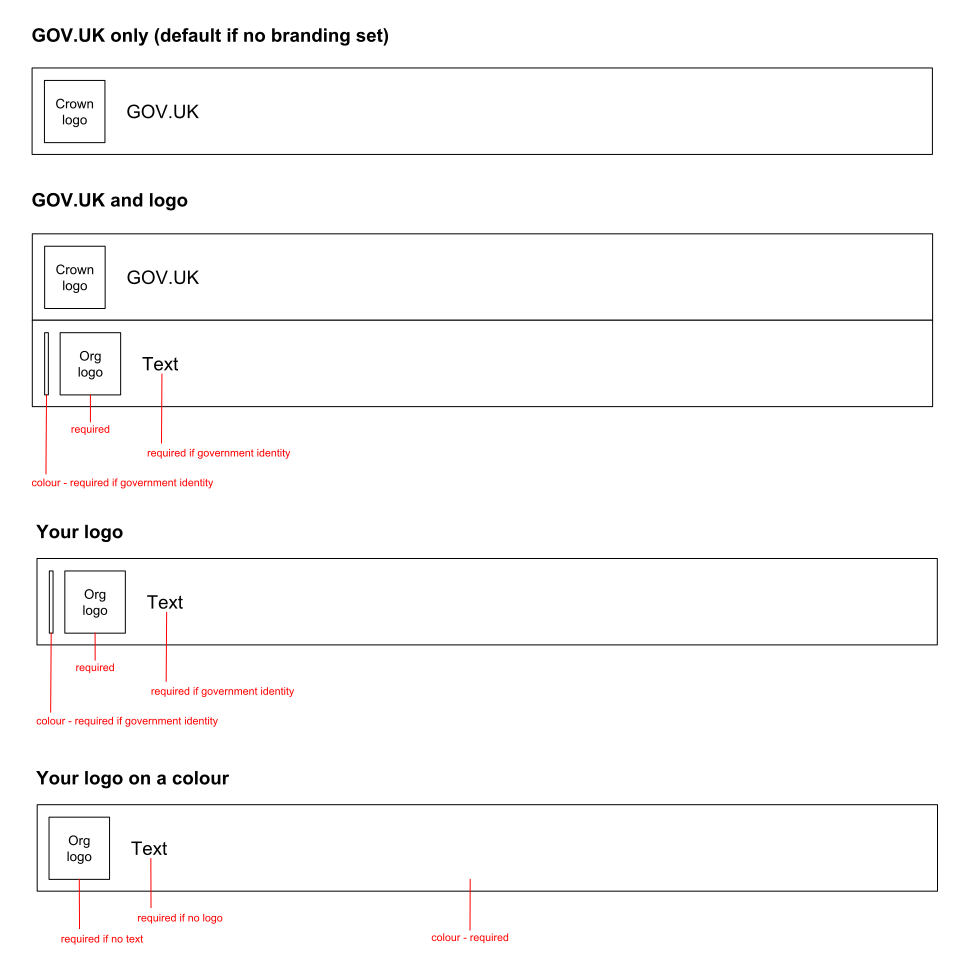

# Documentation for email template

## Email branding

The jinja template can render emails with 1 of 4 different brands. 


Email templates for services without an associated logo will use the first brand, GOV.UK, by default.

Each of the other brands require certain attributes for the template to render them successfully.



Note: the term 'government identity' refers to logos from the [government identity system (PDF, 4.2MB)](https://assets.publishing.service.gov.uk/government/uploads/system/uploads/attachment_data/file/362346/hmg_identity_system_guidelines_2012.pdf).

## Email hacks

HTML emails will be viewed on a large range of client programs and devices. The engine used to render the email can also change. Outlook, for example, has changed its renderer through the versions (see this [history of outlook email rendering](https://www.howto-outlook.com/faq/wordhtml.htm)).

Because of this, our email template relies on hacks to let it display consistently across clients/devices.

### Meta tag to turn off format-detection

Adding the following stops phone numbers being turned into links.

#### Example

`<meta content="telephone=no" name="format-detection" />`

### Duplicate CSS in different parts of the document

Clients will apply CSS depending on how it is defined but this is not consistent so multiple applications are needed.

#### Examples

CSS duplicated between the document head and inline styles.

```
  <style type="text/css">
    body { margin:0 !important; }
```

```
   <body style="margin: 0">
```

Styles duplicated between inline CSS and HTML4-style attributes on the element.

```
  <table
      style="width: 100% !important;"
      width="100%"
  >
```

### Layout using tables

CSS used for layout is ignored by many clients. The pre-CSS method of using tables instead is currently the best way to build layouts that work across the greatest number of clients/devices. See this article on [why use tables for layout in emails](https://litmus.com/blog/the-tyranny-of-tables-why-web-and-email-design-are-so-different).

We give all our tables `role="presentation"` to ensure assistive technologies ignore them. We also zero their `border`, `cell-padding` and `cell-spacing` to ensure clients don't apply their own version of these values.

### Conditional comments for Outlook

Microsoft-specific conditional comments can be used to deliver blocks of HTML only to certain versions of Outlook.

See this article on [using outlook conditional comments](https://templates.mailchimp.com/development/css/outlook-conditional-css/) for more detail.

```
   <!--[if (gte mso 9)|(IE)]>
   ...
   <![endif]-->
```

### Use of !important in CSS

Clients can add their own CSS to emails. Using !important means the preceeding styles have a better chance of overwriting any CSS specific to that client.

### Use of inline CSS

Some clients strip CSS out from the head of the email. Using inline CSS ensures elements will still be styled if this happens.

### Email preheaders

The first line in the `<body>` of the template is used by clients to show a preview of the email (see [the commit that adds the preheader](https://github.com/alphagov/notifications-utils/commit/368b55eb509035e116291ac6346f658bc4b089fc) for details.)

We use CSS to hide it from the email when viewed in full.

### Uppercase margin CSS

outlook.com strips margins out from CSS but capitalising them means it ignores them. This form is still recognised as valid CSS by all other clients. See this article on [margins in outlook.com](https://www.emailonacid.com/blog/article/email-development/outlook-com-does-support-margins/) for details.

### Use of bgcolor instead of background-color in CSS

Support for the CSS property `background-color` across clients is buggy so we use the HTML4-style
`bgcolor` attribute instead. See this guide on [support for
background-color](https://www.campaignmonitor.com/css/color-background/background-color/).
